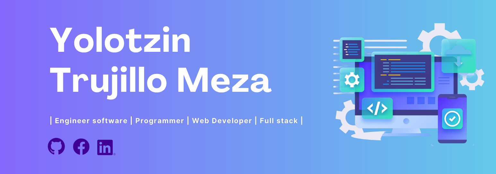

# 👋 ¡Hola! Mi nombre es Yolotzin 👋

## 🚀 SOBRE MI

Soy **Desarrollador Junior Full Stack en formación**, apasionado por la programación, el desarrollo web y las herramientas tecnológicas modernas.

Me encanta aprender nuevas tecnologías, resolver problemas y transformar ideas en soluciones digitales funcionales.

Actualmente sigo fortaleciendo mis habilidades para convertirme en un desarrollador capaz de crear experiencias web modernas, escalables e intuitivas.

> *"Cada línea de código es una oportunidad para aprender, mejorar y construir algo increíble."*

---

## 🛠️ Tecnologías y herramientas

  

---

## 🌱 Actualmente aprendiendo

- Desarrollo Web Full Stack
- Arquitectura de software
- Buenas prácticas de desarrollo
- Diseño UI/UX

---

## 📫 Contacto

📧 yolot562@gmail.com  

💼 LinkedIn: proximamente... 

🌐 Portafolio: Próximamente...

---

⭐ *Gracias por visitar mi perfil*
